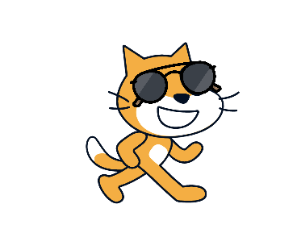

   
  
   
   

## Awesome Scratch Projects 

> A curated list of awesome scratch projects

Inspired by awesome-python.

**Table of Contents**

- [Awesome Scratch Projects](#awesome-scratch-projects)
    - [Starter Projects](#starter-projects)
    - [Microworld](#microworld)
    - [Explore](#explore)
      - [Animations](#animations)
      - [Art](#art)
      - [Games](#games)
      - [Music](#music)
      - [Stories](#stories)
      - [Tutorials](#tutorials)

## Starter Projects
>  Try out these starter projects from the Scratch Team. Look inside and remix to make changes and add your ideas.

### Animation
- [Dance Party](https://scratch.mit.edu/projects/10128067/)
- [Animate the Crab](https://scratch.mit.edu/projects/10015059/)
- [The Pico Show: Intro](https://scratch.mit.edu/projects/10015060/)
- [Greeting Card](https://scratch.mit.edu/projects/11806234/)

## Microworld

## Explore

### Animations

### Art

### Games

### Music

### Stories

### Tutorials

# Contributing

Your contributions are always welcome! <!--Please take a look at the [contribution guidelines](https://github.com/vinta/awesome-python/blob/master/CONTRIBUTING.md) first.-->

I will keep some pull requests open if I'm not sure whether those libraries are awesome, you could [vote for them](https://github.com/vinta/awesome-python/pulls) by adding :+1: to them. 

<!--Pull requests will be merged when their votes reach **20**.-->

- - -

If you have any question about this opinionated list, do not hesitate to contact me [@wwj718](wuwenjie718@gmail.com) or open an issue on GitHub.
